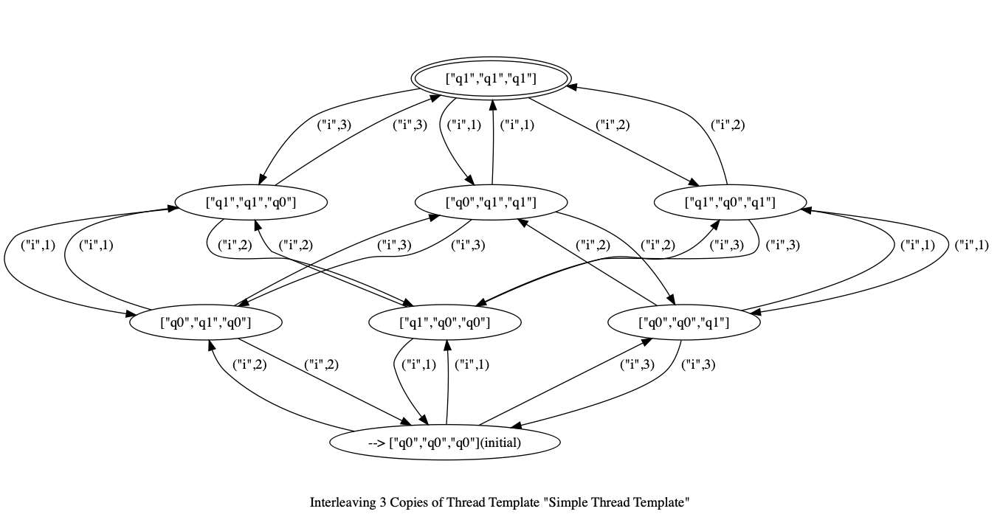

# Mara 

Create DOT graphs from DFAs, with the option of interleaving the DFA (to represent multi-threading) or applying trace-based symmetry reduction or reachability reduction

```
cabal new-build
cabal new-run --  mara -f thread-templates/simple.tt -c -n 4 | tail -n +2 | dot -Tpng > img/simple.png
```

The thread template file contains:
```
{
    "states": ["q0", "q1"]
  , "alphabet": ["i"]
  , "initialState": "q0"
  , "transitions": [["q0", "i", "q1"], ["q1", "i", "q0"]]
  , "finalStates": ["q1"]
  , "caption": "Simple Thread Template"
}
```

which produces the image 


## Options 
```
  -f,--file FILEPATH       Path to thread template file.
  -n,--threadcount INT     Number of threads. (default: 1)
  -c,--cluster             Whether to cluster states.
  -t,--tracereduce         Whether to apply trace reduction.
  -r,--reachreduce         Whether to apply reachability reduction.
  -h,--help                Show this help text
```
